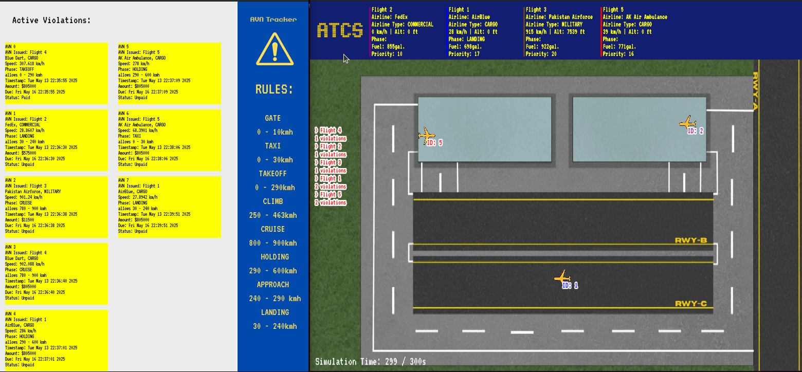
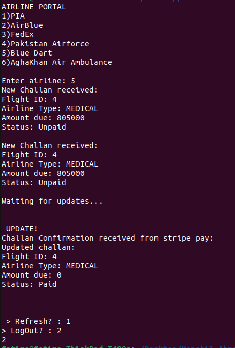
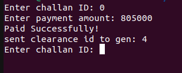

# 🛬 AirControlX - Automated Air Traffic Control System

---

**AirControlX** is a comprehensive simulation of an Automated Air Traffic Control System (ATCS) designed to operate at a multi-runway international airport. Integrating core Operating Systems concepts such as *multithreading*, *synchronization*, *inter-process communication*, and *FCFS and priority-based scheduling*, it manages complex aircraft lifecycles—from arrival and landing to departure and cruising. The system intelligently allocates runways, detects airspace violations through continuous radar monitoring, generates fines (AVNs), and simulates secure payment processing. Moreover, the project effectively utilises OOP(Object Oriented Programming) concepts to ensure a clean, modular code through classes for simulating modern air traffic control.

---
### Flight Phases
- Holding, Approach, Landing, Taxi, Gate, Takeoff, Climb, Cruise

### Airlines
- PIA, AirBlue, FedX, Pakistan Airforce, Blue Dart, Agha Khan Air Ambulance

### Airline Types
*From highest to lowest priority*
- Medical
- Military 
- Cargo
- Commercial

## Functionalities

### Runway Allocation
- Airport has **three runways**:
  - `RWY-A`: For arrivals (North/South). North for *International, South for Domestic*
  - `RWY-B`: For departures (East/West). East for *International, West for Domestic*
  - `RWY-C`: For emergencies, cargo, and overflow(from runway A and B). *Any direction*
- Each runway can only be occupied by **one aircraft at a time**, enforced with **mutex locks**.

### Flight Scheduling and Queuing
- Automatically schedules and queues flights based on time of arrival, direction, runway availability, and priority.
- All flights that are yet to be dispatched, wait in a waiting queue.
- Includes a **dispatcher thread** to dispatch flights over simulation time based on their scheduled time or forefully preempt lower priority flighhts if higher prioroty flights arrive.
- Dispatcher ensures that ground faults are handled and the faulty aircraft is towed away.
- Dispatcher ensures that Runway C is used for overflow.
- Queued flights follow **priority-based FCFS** rules.

### Flight Simulation
- Simulation lasts for a maximum of **5** mins.
- The number of flights per simulation can be changed.
- The user enters the data for each flight.
- Simulates arivals and departures from various airlines.
- Implements smooth transition between realistic flight phases through altitude and speed limits.

### Violation Detection & AVN System
- A **radar thread** continuously monitors each flight’s speed based on its phase.
- Violations (excessive speed or altitude) result in the generation of an **Airspace Violation Notice (AVN)**.
- Each AVN includes:
  - Airline name, Airline type, Flight number, Speed of violation, Phase of violation, Fine amount, Payment status, Issuance time, and Due date

## Processes
Our project employs **4** unique process that communicate through **named pipes**.

### ATCS Controller Process
- monitor the speed, altitude, and position of every aircraft in the airspace.
- If any aircraft exceeds the designated airspace boundary, altitude limit, or speed restriction, the system will notify the **AVN Generator Process**.
- Maintains detailed analytics about the air traffic including a dashboard fro active violationsa and aircrafts with active violations.
- Lastly, it visually represents each aircraft in dirfferent phases.

### AVN Generator Process
- Creates AVN including
- Calculates fine (total + service charges) depecding on airline type.
- Updates the payment status to "paid" when it recieves confirmation from **StripePay** process.
- Sends confirmation to the **Airline Portal**
- Notifies the **ATC controller** that the airline has cleared the violation
  
### Airline Portal Process
- allows airline admins to view all AVNs related to their flights
- Upon receiving a successful payment alert from the StripePay process, the Airline Portal updates the corresponding AVN entry to reflect the payment and displays all associated details

### StripePay Process
- Simulates secure AVN fine payments from Admin
- Successful payments update the portal and notify the ATC controller

---

## Simulation Output
This is a simulation with 5 input flights.

### ATCS Interface

### Airline Portal

### StripePay

---

## Technologies & Concepts

- **C++11** (core logic)
- **POSIX Threads** (`pthreads`) for concurrency
- **Mutexes and Semaphores** for synchronization
- **Named Pipes (FIFOs)** for IPC
- **SFML** for graphics

---
